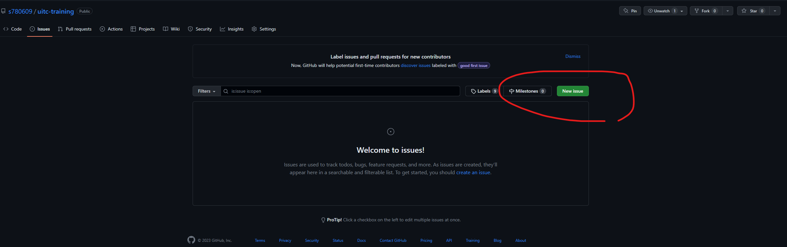
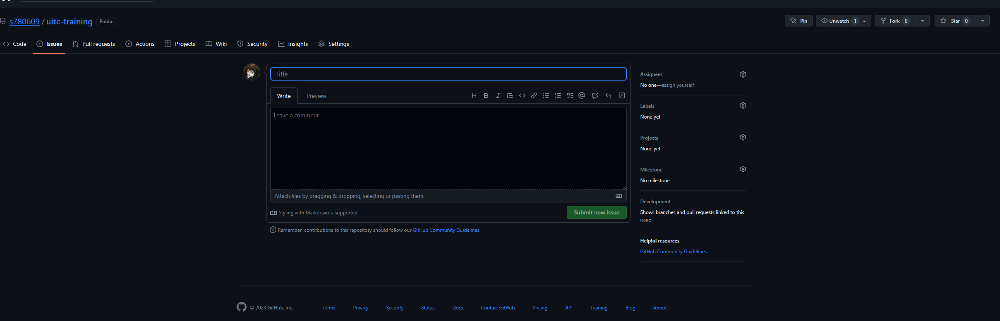

# UITC-Training project

## 說明
這個訓練計畫計畫使用 Huli 的線上JS課程，來使新人的JS能力可以達到一般基礎能力，並且了解JS語言的基本觀念   

[Huli 線上課程首頁](https://lidemy.com/)

帳密: 去跟你的mentor要

## 流程
請先 fork 一份專案到自己的github裡面，並且依照週數順序來完成課程

## 問題
有問題的話，而你的mentor又不在，又感覺同事都凶神惡煞(或是他們都在忙XD)，不敢問的話，可以在 issue 那裏開一個 新 issue，詳細描述你遇到的困難或是問題   
開 issue 位置如下

開新issue請注意以下事項
* title 要記得寫你是誰
* 如果問題是程式碼的問題，那最好可以先寫一個能夠重現你的問題的一支程式，並且推上github的這個專案
* comment 最好可以有你的github連結，方便別人可以先看你是遇到甚麼

